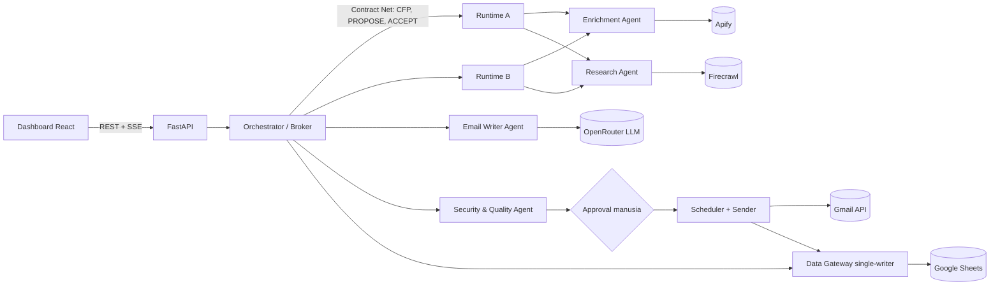

# Outreach Control — Sistem Multi-Agent Email Writer & Enrichment

Prototipe tugas **Agen Cerdas Enterprise** (Magister Kecerdasan Artifisial UGM, Kelompok 1). Sistem ini mengubah data
prospek menjadi email personal yang bisa diaudit. Agen spesialis mengerjakan enrichment, riset bukti, penulisan, dan
pemeriksaan keamanan; manusia memegang keputusan kirim.

Rancangan lengkapnya ada di `Laporan_Multi_Agent_Email_Writer_Enrichment_Kelompok_1.docx`. Kode ini mengikuti laporan
tersebut; nomor bagian (§) di README merujuk ke laporan.

> **Status (22-09-2026):** 43 tes backend lulus dan alur lengkap sudah dicoba dalam mode simulasi. Koneksi ke
> OpenRouter, Apify, Firecrawl, dan Google Sheets sudah diuji (tanpa biaya). **Belum diuji:** campaign dengan
> layanan live dan pengiriman Gmail sungguhan. Lihat [Status & keterbatasan](#status--keterbatasan).

---

## Daftar isi

- [Mulai dari mana (per peran)](#mulai-dari-mana-per-peran)
- [Arsitektur](#arsitektur)
- [Menjalankan di laptop](#menjalankan-di-laptop)
- [Konfigurasi layanan](#konfigurasi-layanan)
- [Cara memakai dashboard](#cara-memakai-dashboard)
- [Pengaman yang sudah dibangun](#pengaman-yang-sudah-dibangun)
- [Pengujian](#pengujian)
- [Status & keterbatasan](#status--keterbatasan)
- [Aturan kerja tim](#aturan-kerja-tim)

---

## Mulai dari mana (per peran)

| Anggota | Peran | Mulai dari | Untuk apa |
|---|---|---|---|
| Aditya Nurrohman | Leader & Evaluator | [Status & keterbatasan](#status--keterbatasan), [Pengujian](#pengujian), tab **Monitor** (biaya, token, p95, migrasi) | Koordinasi prioritas; bukti metrik untuk §9 Evaluasi |
| Amar Ma'ruf | Presenter | [Cara memakai dashboard](#cara-memakai-dashboard), mode **Satu orang** | Skenario demo yang aman |
| St. Syakirah | Programmer | `backend/app/`, `backend/tests/`, [docs/runbook-aplikasi.md](docs/runbook-aplikasi.md) | Alur agen, API, tes |
| Amelia Gizzela Sheehan Auni | Designer | `frontend/src/`, [PRODUCT.md](PRODUCT.md) | UI Setup → Preview & Approval → Monitor |
| Gregorius Bugen Jovi Sitindaon | Researcher | [docs/peta-laporan.md](docs/peta-laporan.md), prompt di `backend/app/agents.py` | Kesesuaian dengan laporan dan SOTA |

---

## Arsitektur



| Komponen | File | Bagian laporan |
|---|---|---|
| Orchestrator: state machine per lead, Contract Net, checkpoint/lease/generation, pemulihan | `backend/app/orchestrator.py` | §5.1–5.3 |
| Agen Enrichment (entity linking S = 0,40d + 0,30n + 0,20c + 0,10r), Research, Writer, Security | `backend/app/agents.py` | §5.2, §6 |
| Scheduler & Gmail sender: kunci kirim, `SENT_UNKNOWN`, allowlist | `backend/app/scheduler.py` | §5.2, §8.3 |
| Data Gateway: 8 tab Sheets (Campaigns, Leads, Evidence, Templates, Tasks, Emails, Suppression, Audit) | `backend/app/store.py` | §7.1 |
| Adapter layanan eksternal + mode simulasi | `backend/app/integrations.py` | §7.3 |
| Autentikasi Google (service account + OAuth) | `backend/app/google_auth.py` | §7.3 |
| API | `backend/app/main.py` | — |
| Dashboard | `frontend/src/pages/` | §8.2 |

Struktur folder:

```
backend/        FastAPI, agen, tes (pytest), data fiktif
frontend/       React + TypeScript + Vite
docs/           Runbook aplikasi, peta laporan, catatan insiden, gambar/ (tangkapan layar)
presentasi/     Deck PowerPoint + generator (npm run build)
tools/          Pemeriksa angka laporan, skrip screenshot
.env.example    Templat konfigurasi (salin ke .env)
run-dev.ps1     Menjalankan backend + dashboard sekaligus (Windows)
```

---

## Menjalankan di laptop

**Prasyarat:** Python 3.11+, Node.js 20+ (sudah diuji dengan Node 24), Git.

```powershell
git clone https://github.com/adityanrrhmn/agen-cerdas-enterprise.git
cd agen-cerdas-enterprise

# Backend
cd backend
python -m venv .venv
.venv\Scripts\python -m pip install -r requirements.txt
cd ..

# Frontend
cd frontend
npm install
cd ..

# Konfigurasi
copy .env.example .env      # lalu isi nilainya, lihat bagian berikut
```

Jalankan (Windows): `powershell -ExecutionPolicy Bypass -File run-dev.ps1`. Perintah ini membuka backend di
`http://127.0.0.1:8000` dan dashboard di **http://localhost:5173**.

Manual (semua OS):

```bash
cd backend && .venv/Scripts/python -m uvicorn app.main:app --port 8000   # macOS/Linux: .venv/bin/python
cd frontend && npm run dev
```

**Belum punya Google Client ID/Secret?** Aplikasi tetap berjalan dalam **mode draf**: semua agen bekerja, dan hasil
akhirnya berupa isi email yang bisa difinalkan, disalin, atau diunduh (.eml per draf, CSV per campaign). Tidak ada
email yang dikirim. Mode diatur `DELIVERY_MODE=auto|draft|send` (default `auto`).

**Tanpa key sama sekali?** Set `SIMULATE_INTEGRATIONS=true` dan `DATA_BACKEND=local` di `.env`. Semua layanan akan
memakai data fiktif; UI menandainya dengan jelas dan tidak ada biaya.

---

## Konfigurasi layanan

Semua key dibaca dari `.env`. **Jangan pernah commit `.env` atau folder `secrets/`**; keduanya sudah di-gitignore.
Bagikan key ke anggota tim lewat kanal privat, bukan lewat repo atau grup chat umum.

| Layanan | Variabel | Catatan |
|---|---|---|
| OpenRouter (LLM) | `OPENROUTER_API_KEY`, `OPENROUTER_MODEL` | Default `anthropic/claude-sonnet-5` (mendukung structured output) |
| Apify (enrichment) | `APIFY_TOKEN`, `APIFY_ENRICHMENT_ACTOR`, `APIFY_ENRICHMENT_INPUT` | Actor `anchor~linkedin-profile-enrichment` butuh URL LinkedIn. Lead tanpa `linkedin_url` tidak memanggil Apify (tanpa biaya) |
| Firecrawl (riset web) | `FIRECRAWL_API_KEY` | Satu pencarian per lead |
| Google Sheets | `GOOGLE_SERVICE_ACCOUNT_FILE`, `SHEETS_SPREADSHEET_ID` | Lihat langkah di bawah |
| Gmail (opsional) | `GOOGLE_CLIENT_ID`, `GOOGLE_CLIENT_SECRET`, `GMAIL_ALLOWLIST`, `GMAIL_SEND_ENABLED` | Kosong = mode draf. Tanpa refresh token manual; hubungkan lewat tombol di dashboard |

**Google Sheets (service account):**
1. Google Cloud Console → aktifkan **Google Sheets API** dan **Gmail API**.
2. IAM & Admin → Service Accounts → buat → Keys → Add key → JSON. Simpan sebagai `secrets/google-service-account.json`.
3. Buka spreadsheet → **Share** → tambahkan email service account (`…@….iam.gserviceaccount.com`) sebagai **Editor**.
4. Isi `SHEETS_SPREADSHEET_ID` dari URL spreadsheet. Tab dan header dibuat otomatis saat backend start.

**Gmail (tombol "Hubungkan akun Google"):**
1. Credentials → OAuth client ID tipe **Desktop app**. Kalau memakai tipe *Web application*, tambahkan redirect
   `http://127.0.0.1:8000/api/google/callback`.
2. OAuth consent screen → tambahkan akun pengirim sebagai **Test user**.
3. Isi `GOOGLE_CLIENT_ID` dan `GOOGLE_CLIENT_SECRET`, restart backend, lalu klik **Hubungkan akun Google** di tab
   **Koneksi**. Token disimpan di `backend/data/google-oauth.json` (di-gitignore). Pada status Testing, token berlaku
   7 hari.
4. Email **hanya terkirim** bila `GMAIL_SEND_ENABLED=true` **dan** penerima ada di `GMAIL_ALLOWLIST`.

Tombol **Tes** di tab Koneksi memeriksa tiap layanan tanpa biaya.

---

## Cara memakai dashboard

**1. Setup**
- Pilih **Satu orang** (tepat 1 penerima, dikunci sistem; cocok untuk demo atau uji kirim) atau **Banyak lead**.
- Isi tujuan, penawaran, ajakan (CTA), personalisasi, nama pengirim, dan anggaran LLM.
- Tambah lead:
  - **Manual:** cukup *nama lengkap* dan *deskripsi*, misalnya "Azhari" dengan deskripsi "Dosen di UGM serta guru besar
    di sana". Email boleh menyusul. Centang izin kontak; tanpa izin, lead diblokir.
  - **CSV** (mode banyak lead): kolom wajib `name` serta `company` atau `description`. Kolom opsional: `email, domain,
    title_hint, linkedin_url, permission_status, permission_ref, crm_id`.
  - **Data fiktif:** 100 lead `.example` dengan kasus uji (tanpa izin, email invalid, duplikat, nama ambigu).
- Klik **Jalankan agen**.

**2. Preview & Approval**
- Filter: Siap disetujui / Perlu review / Diblokir / Terkirim.
- Setiap draft menampilkan alasan keputusan Security. Kata di email yang berasal dari fakta ditandai nomor yang
  merujuk ke **Jejak bukti** (sumber, waktu pengambilan, kutipan).
- Edit draft membatalkan approval lama dan memicu pemeriksaan ulang. Draft REVIEW hanya bisa disetujui satu per satu
  setelah mencentang konfirmasi.
- Nama ambigu: pilih kandidat yang benar, atau lanjutkan tanpa enrichment.

**Mode draf** (Google Client ID/Secret kosong atau `DELIVERY_MODE=draft`): label kuning "Mode draf" tampil di bar atas.
Langkah 2 menjadi **Preview & Finalisasi**. Tombol "Setujui" menjadi **Finalkan**, dan email penerima opsional. Draf final
bisa di-**Salin subjek / Salin isi / Salin semua / Unduh .eml**, dan seluruh campaign bisa diunduh lewat **Unduh semua (CSV)**.
Pengaman izin kontak, grounding, dan review identitas tetap berlaku.

**3. Monitor**
- Alur task per tahap, runtime A/B (pindahkan task atau matikan runtime untuk melihat migrasi), riwayat migrasi,
  antrean kirim, biaya dan token, serta pesan antaragen secara langsung.

**Skenario demo aman (disarankan):** Satu orang → lead manual berisi email anggota tim yang ada di allowlist →
Jalankan agen → periksa draft dan bukti → Setujui → email terkirim beberapa detik kemudian.

---

## Pengaman yang sudah dibangun

- **Izin & daftar larangan:** hanya `permission_status=granted`; suppression dan duplikat → BLOCK. LLM tidak dapat
  membatalkan BLOCK.
- **Grounding:** maksimal 3 fakta per draft. Kutipan fakta web harus ada persis di halaman sumber. Angka yang tidak
  didukung fakta → REVIEW.
- **Prompt injection:** halaman berisi instruksi mencurigakan dibuang dan dicatat sebagai insiden.
- **Identitas:** diterima otomatis hanya bila S ≥ 0,85 dan unggul ≥ 0,10; selebihnya direview manusia. Riset untuk lead
  manual hanya memakai halaman yang menyebut nama **dan** instansinya. Data pribadi sensitif dilarang.
- **Kirim:** approval terikat hash (penerima, isi, versi, konfigurasi). Status `SENDING` disimpan sebelum memanggil
  Gmail. Hasil yang tidak pasti ditandai `SENT_UNKNOWN` dan tidak dikirim ulang otomatis. Ada allowlist dan
  saklar `GMAIL_SEND_ENABLED`.
- **Mode satu penerima:** dikunci di tiga lapis (tambah lead, approval, scheduler).
- **Anggaran LLM** per campaign; pause/resume berhenti di checkpoint.

---

## Pengujian

```bash
cd backend && .venv/Scripts/python -m pytest -q     # 43 tes; tanpa jaringan dan tanpa key
cd frontend && npx tsc -b                            # cek tipe
```

Tes disusun dari kebutuhan laporan: rumus S, keputusan BLOCK/REVIEW/PASS, batas revisi, approval batal saat diedit,
tidak kirim ganda, `SENT_UNKNOWN`, penolakan generation lama saat migrasi, pemulihan setelah restart, bentuk request
ke setiap API (dengan transport tiruan), lead manual, dan mode satu penerima.

Verifikasi tampilan tanpa biaya (backend simulasi + screenshot desktop/mobile): lihat
[docs/runbook-aplikasi.md](docs/runbook-aplikasi.md#verifikasi-tampilan-tanpa-biaya).

---

## Status & keterbatasan

| Hal | Status |
|---|---|
| Logika agen, orchestrator, migrasi, scheduler, lead manual, satu penerima, mode draf | Lulus (43 tes) |
| Koneksi OpenRouter, Apify, Firecrawl, Google Sheets | Lulus (tes tanpa biaya) |
| Alur lengkap via dashboard | Lulus di mode **simulasi** |
| Campaign dengan layanan live | **Belum diuji** (memakai kredit) |
| Hubungkan Gmail dan kirim sungguhan | **Belum diuji** |
| Output actor Apify | Dipetakan dari skema publik actor; belum diuji dengan run nyata |

Keterbatasan yang disadari:
- Satu proses backend adalah satu-satunya penulis ke Sheets. Jangan mengedit kolom state (Tasks, Emails) secara manual
  saat aplikasi berjalan.
- Runtime A/B untuk migrasi berjalan dalam satu proses (mobilitas logis, §5.3), bukan dua server terpisah.
- Gmail memakai izin *kirim saja*; balasan dan kotak Terkirim tidak dibaca, sehingga `SENT_UNKNOWN` direkonsiliasi manual.
- Angka kinerja di laporan §9.2 adalah ilustrasi analitis, bukan hasil pengukuran prototipe ini.

---

## Laporan dan presentasi

- **Laporan:** `Laporan_Multi_Agent_Email_Writer_Enrichment_Kelompok_1.docx` (17 halaman), sudah memuat realisasi prototipe
  (§5.4), tangkapan layar (§8.4, Gambar 5–8), dan hasil pengujian (§9.3). Cara memeriksa: `tools/periksa-laporan.ps1`.
- **Presentasi:** `presentasi/Presentasi_Outreach_Control_Kelompok_1.pptx` (17 slide, 16:9, catatan pembicara di tiap slide).
  Untuk mengubah teks: sunting `presentasi/build-deck.js`, lalu `cd presentasi && npm install && npm run build`.
- **Tangkapan layar:** `docs/gambar/`, diambil dari mode simulasi dengan data fiktif. Cara mengambil ulang ada di
  [docs/runbook-aplikasi.md](docs/runbook-aplikasi.md#verifikasi-tampilan-tanpa-biaya).

## Aturan kerja tim

- Buat branch per pekerjaan (`fitur/...`, `perbaikan/...`), lalu buka pull request ke `main`.
- Sebelum push: jalankan `pytest` dan `npx tsc -b`, dan pastikan `git status` tidak memuat `.env`, `secrets/`, atau
  `backend/data/google-oauth.json`.
- Data contoh harus fiktif (domain `.example`). Jangan commit data pribadi atau NIM.
- Perubahan angka/asumsi laporan: ikuti matriks di [docs/peta-laporan.md](docs/peta-laporan.md).
- Panduan untuk asisten AI (Claude Code/Codex) ada di [AGENTS.md](AGENTS.md).
